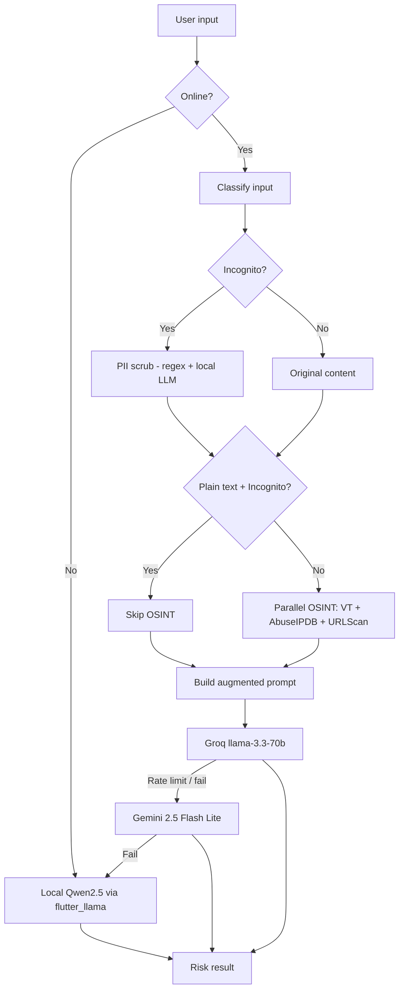

# SMD — Scam Message Detector

**Gen Digital · Norton Mobile Engineering AI-First Intern Assignment**  
**Author:** Shakhzod  
**Chosen option:** **Option B — Scam Message Detector Prototype**

---

## Project Overview

**SMD.** is a Flutter mobile app that helps users check whether a suspicious SMS, email snippet, URL, or `.eml` file looks like a scam. You paste or attach content, tap **Analyze**, and the app returns a risk level (`SAFE`, `SUSPICIOUS`, or `DANGEROUS`), a confidence score, and a short explanation.

The app goes beyond a simple “send text to ChatGPT” flow. It runs a small **SOAR-style pipeline** (Security Orchestration, Automation, and Response):

1. Classify the input (plain text, URL, IP, or EML)
2. Optionally scrub PII when **Incognito mode** is on
3. Gather threat intelligence from external APIs (VirusTotal, AbuseIPDB, URLScan.io)
4. Build an augmented prompt with OSINT context
5. Send it to cloud AI (Groq → Gemini cascade)
6. Fall back to an on-device model when offline or when cloud APIs fail

I built this as a prototype, not a production Norton product. The focus was on clean architecture, realistic threat-analysis flow, and learning how to work with AI tools during development.

---

## Features

| Feature | Description |
|--------|-------------|
| **Message analysis** | Paste suspicious text or links and get a structured risk verdict |
| **EML attachment** | Pick an `.eml` file; the app parses the body and reads SPF/DKIM/DMARC headers |
| **Sample messages** | Three built-in examples (fake bank alert, prize scam, IRS impersonation) |
| **Cloud AI cascade** | Groq (`llama-3.3-70b-versatile`) first, then Gemini (`gemini-2.5-flash-lite`) |
| **OSINT enrichment** | VirusTotal, AbuseIPDB, and URLScan.io run in parallel when URLs/IPs are found |
| **Incognito mode** *(extra)* | On-device Qwen2.5-1.5B model (~1 GB), PII redaction, optional OSINT skip |
| **Offline support** | Uses the local model when there is no internet (if downloaded) |
| **Background model download** | Large model downloads in the background with progress UI and notifications |
| **Result UI** | Risk badge, confidence bar, and explanation card with fade/slide animation |
| **Norton-inspired theme** | Light UI with Norton yellow accents; subtle warm tint in Incognito mode |

---

## Setup Instructions

### Prerequisites

- [Flutter SDK](https://docs.flutter.dev/get-started/install) **^3.11.0**
- Android Studio / Xcode for device emulators (or a physical device)
- API keys (see below)

### 1. Clone and configure environment

```bash
git clone <your-repo-url>
cd norton-aifirst-intern-shakhzod
cp .env.example .env
```

Edit `.env` and add your keys:

| Variable | Required | Purpose |
|----------|----------|---------|
| `GEMINI_API_KEY` | **Yes** (for cloud analysis) | [Google AI Studio](https://aistudio.google.com/apikey) |
| `GROQ_API_KEY` | Recommended | Primary cloud provider (free tier) |
| `VIRUSTOTAL_API_KEY` | Optional | URL reputation lookup |
| `ABUSEIPDB_API_KEY` | Optional | IP abuse scoring |
| `URLSCAN_API_KEY` | Optional | URL scan submission |

OSINT calls fail gracefully if keys are missing — analysis still works, just without threat-intel context.

### 2. Install dependencies and generate code

```bash
flutter pub get
dart run build_runner build --delete-conflicting-outputs
```

This generates Riverpod providers, Freezed models, and `envied` env bindings.

### 3. Android: set up on-device AI (flutter_llama)

The `flutter_llama` package on pub.dev does not ship `llama.cpp` sources. You need a one-time setup script after every `flutter pub get` or cache clear:

**Windows (PowerShell):**

```powershell
.\tool\setup_flutter_llama.ps1
```

**macOS / Linux:**

```bash
chmod +x tool/setup_flutter_llama.sh
./tool/setup_flutter_llama.sh
```

The script clones `llama.cpp` into the pub cache and applies CPU-only Android patches (Vulkan cross-compile was failing on my setup).

> **Note:** Incognito mode and offline analysis only work after this step **and** after downloading the ~1 GB Qwen model inside the app.

### 4. Run the app

```bash
flutter run
```

**Release APK (Android):**

```bash
flutter build apk --release
# Output: build/app/outputs/flutter-apk/app-release.apk
```

### Troubleshooting

| Problem | Fix |
|---------|-----|
| Kotlin cache errors (project on `E:` drive, pub cache on `C:`) | `android/gradle.properties` already sets `kotlin.incremental=false` |
| CMake / llama build errors | Run `flutter clean`, re-run the setup script, then build again |
| Cloud analysis fails | Check `.env` keys; Groq free tier rate-limits quickly — Gemini is the fallback |
| Incognito analysis crashes on Android | Make sure setup script ran; local inference uses CPU-only config (`nGpuLayers: 0`) |

---

## Architecture / Technical Overview

The project uses **feature-first clean architecture** with **Flutter Riverpod**, **Freezed**, **go_router**, and **Dio**.

```
lib/
├── core/                    # Shared: theme, routing, env, notifications, background tasks
├── features/
│   ├── splash/              # Animated splash → home
│   └── scam_detector/
│       ├── data/            # Repositories, datasources, DTOs, services
│       ├── domain/          # Entities, use cases, repository interfaces
│       └── presentation/    # Screens, widgets, Riverpod controllers
└── main.dart
```

### Analysis pipeline



### Key components

| Layer | Component | Role |
|-------|-----------|------|
| Domain | `OrchestrateScamAnalysisUseCase` | Main SOAR orchestrator |
| Domain | `BuildAugmentedPromptUseCase` | Merges scrubbed text + OSINT + email auth |
| Data | `ScamAnalysisRepositoryImpl` | Groq → Gemini cloud cascade |
| Data | `LocalScamAnalysisService` | On-device scam verdict via `flutter_llama` |
| Data | `LocalPiiRedactionService` | Hybrid regex + local LLM PII scrubbing |
| Data | `ModelDownloadService` | Background download of Qwen2.5 GGUF from Hugging Face |
| Presentation | `ScamAnalysisController` | Riverpod state for analyze / reset |
| Presentation | `IncognitoModeController` | Toggle + model download lifecycle |

### Tech stack

- **Flutter** 3.11+, **Dart** 3.11+
- **State:** `flutter_riverpod` + `riverpod_annotation`
- **Routing:** `go_router`
- **Networking:** `dio`, `google_generative_ai`
- **Local AI:** `flutter_llama` + Qwen2.5-1.5B-Instruct (Q4_K_M, ~1 GB)
- **Background work:** `background_downloader`, `flutter_foreground_task`, `flutter_local_notifications`
- **Email parsing:** `enough_mail`
- **Code gen:** `freezed`, `json_serializable`, `envied`, `build_runner`

---

## Screenshots

> Replace the placeholders below with actual screenshots from a running build.

| Screen | Description |
|--------|-------------|
| Home (cloud mode) | Main input, sample messages, Analyze button |
| Analysis result | Risk badge + confidence bar + explanation |
| Incognito mode | Warm privacy accent, download progress |
| Offline warning | Dialog when no network and no local model |

```
docs/screenshots/01-home-cloud.png
docs/screenshots/02-analysis-result-dangerous.png
docs/screenshots/03-incognito-mode.png
docs/screenshots/04-eml-attachment.png
docs/screenshots/05-offline-local-result.png
```

<!-- When adding images, use:

-->

---

## Demo Video

> Record a short walkthrough (2–3 minutes) showing: paste sample → analyze → result → toggle Incognito → offline behavior.

```
docs/demo/smd-demo.mp4
```

**Suggested demo script:**
1. Open app, tap a sample message (e.g. “Fake bank alert”)
2. Analyze and show `DANGEROUS` result with explanation
3. Attach an `.eml` file and show email-auth context in logs
4. Enable Incognito, show model download dialog
5. Turn off Wi‑Fi, analyze again with on-device model

---

## AI Interaction Log

Below are real examples of how I used Cursor during this project. I did not copy AI output blindly — I reviewed, tested, and often sent follow-up prompts to fix wrong suggestions.

---

### 1. Initial architecture scaffold

**Prompt:**
> Set up a Flutter scam detector with clean architecture: data/domain/presentation under `lib/features/scam_detector`, Riverpod for state, go_router for navigation, and a Gemini datasource that returns structured JSON with risk_level, confidence, explanation.

**AI response (summary):**
Suggested a standard 3-layer folder layout, a `ScamAnalysis` Freezed entity, `GeminiRemoteDataSource` with `responseSchema`, and a `ScamAnalysisController` Riverpod notifier.

**My commentary:**
Good starting point. I kept the structure but renamed things to match my SOAR idea later. The AI put everything in one repository — I split OSINT, PII, and EML into separate repositories when the pipeline grew. I also added Groq as the primary cloud provider because Gemini alone was hitting quota during testing.

---

### 2. SOAR pipeline design (iterative)

**Prompt:**
> I want a use case that: scrubs PII when incognito is on, runs VirusTotal + AbuseIPDB + URLScan in parallel, parses EML auth headers, builds one master prompt, then calls Gemini. OSINT errors should not block analysis.

**Follow-up prompt (after first draft was too coupled):**
> Extract prompt building into its own use case. OSINT repos should return nullable results. Incognito + plain text should skip OSINT entirely.

**AI response (summary):**
Created `OrchestrateScamAnalysisUseCase`, `BuildAugmentedPromptUseCase`, and `ThreatIntelSnapshot`. Used `Future.wait` with `.onError` swallowing for OSINT calls.

**My commentary:**
The second prompt was necessary — the first version had a 200-line god method. I verified OSINT skip logic with unit tests (`incognito + plain text skips OSINT entirely`). The AI initially tried to await OSINT sequentially; I asked for parallel execution to keep analyze latency reasonable.

---

### 3. Debugging flutter_llama SIGABRT (ggml_abort)

**Prompt:**
> Android app crashes with SIGABRT during second local analysis call. Log shows ggml_abort in llama_context::decode. Using flutter_llama 1.1.2 with Qwen2.5-1.5B. First analyze works, second crashes.

**Follow-up prompt:**
> AI suggested increasing contextSize. Still crashes on long prompts. Read flutter_llama_bridge.cpp — it puts the whole prompt in one batch. What batchSize do I need?

**AI response (summary):**
Identified two issues: (1) KV cache not cleared between `generate()` calls — need `unloadModel()` in a `finally` block; (2) `batchSize` must be ≥ prompt token count — set `batchSize: 4096` equal to `contextSize: 4096`.

**My commentary:**
This took many iterations and was the hardest part of the project. The AI’s first answer (just increase threads) was wrong. I read the native bridge source myself, then asked a targeted follow-up. The fix is in `LocalScamAnalysisService._loadModelFresh`. I added regression tests so this does not break again. **Lesson:** for native plugin crashes, generic AI advice is often useless — you need to combine logs, source reading, and specific questions.

---

### 4. Local model returns prose instead of JSON

**Prompt:**
> Qwen2.5-1.5B on device ignores “respond with JSON only” and returns `SUSPICIOUS: This message looks like phishing because...`. Cloud models follow schema fine. How should I parse this without failing the whole offline path?

**AI response (summary):**
Suggested ChatML few-shot prompt with a worked JSON example, lower temperature (0.1), and a fallback parser that extracts `SAFE`/`SUSPICIOUS`/`DANGEROUS` from free text when JSON parsing fails.

**My commentary:**
I implemented both: improved prompt **and** `_tryParseLabelled` fallback. I rejected the AI suggestion to “just use regex on the whole response” — too fragile. The hybrid approach (try JSON first, then label parser) is tested in `local_scam_analysis_service_test.dart`. Offline accuracy is still weaker than cloud — that is a model-size limitation, not a parser bug.

---

### 5. Incognito UI and background download

**Prompt:**
> Build an Incognito mode switch widget: shield icon, subtitle explaining on-device vs cloud, confirmation dialog before ~1 GB download, linear progress while downloading, disable switch during download. Match existing AppColors and use Norton yellow accent when enabled.

**Follow-up prompt:**
> Download should continue in background when user closes app. Use background_downloader and show a notification when complete. Wire progress to a Riverpod StateProvider.

**AI response (summary):**
Generated `IncognitoModeSwitch`, dialog copy, and integration with `ModelDownloadService` + `BackgroundWorkCoordinator`.

**My commentary:**
UI code was mostly fine. I changed the dialog text to be clearer about background download (AI’s first version said “please wait” which is wrong for a 1 GB file). I also added `LlamaNativeProbe` after AI’s code crashed on emulators missing native `.so` files — the AI did not suggest that guard initially.

---

### 6. Unit tests for cloud cascade

**Prompt:**
> Write tests for ScamAnalysisRepositoryImpl: Groq success skips Gemini; Groq 429 falls through to Gemini; missing Groq key goes straight to Gemini; both fail throws GeminiDataSourceException. Use mockito.

**AI response (summary):**
Generated mock classes and five test cases with `http_mock_adapter` pattern for datasources.

**My commentary:**
Tests were a good template. I fixed incorrect mock setup where Groq was stubbed to throw a generic `Exception` instead of `GroqDataSourceException` — cascade logic depends on the typed exception. Final suite: **88 passing tests** across repositories, services, and the orchestrator use case.

---

## AI Code Review Summary

I asked Cursor to review completed modules before merging. Below is what it suggested and what I actually changed.

| Area | AI suggestion | What I did |
|------|---------------|------------|
| **Orchestrator error handling** | Wrap every step in try/catch and show raw errors to UI | Kept typed exceptions (`AnalyzeMessageException`); OSINT failures are swallowed, cloud failures trigger local fallback |
| **LocalScamAnalysisService** | Use streaming `generateStream()` for better UX | Rejected — `flutter_llama` 1.1.2 has EventChannel race bugs; kept non-streaming `generate()` with timeout |
| **PII redaction** | Send raw text to cloud after regex only | Rejected for Incognito — built hybrid: regex baseline + local LLM, with validation that rejects bad LLM output |
| **Gemini model ID** | Use `gemini-1.5-pro` | Changed to `gemini-2.5-flash-lite` after checking latency and structured-output support |
| **Repository cascade** | Single provider with retry loop | Accepted pattern but simplified: Groq → Gemini only, local fallback stays in use case |
| **HomeScreen** | Split into 3 separate widget files immediately | Partially accepted — extracted widgets (`ResultCard`, `IncognitoModeSwitch`, etc.) but kept screen logic in one file for readability |
| **Model download** | Block UI with modal until download finishes | Rejected — background download + notification is better UX for 1 GB |
| **Android llama build** | Enable GPU/Vulkan for speed | Rejected — caused `ggml_abort` on multiple devices; CPU-only patch in `tool/patches/flutter_llama/` |
| **Widget test** | Assert text "Try an example" | Test is outdated — UI now says "Sample messages" / "Tap to try one"; test needs update |

**Overall:** AI was strong for boilerplate, test scaffolds, and exploring options. It was weak on native plugin edge cases and sometimes over-engineered error handling. The best results came when I gave small, specific prompts with file names and actual error logs.

---

## Testing

### Run all tests

```bash
flutter test
```

### Current status

| Category | Files | Notes |
|----------|-------|-------|
| Cloud datasources | `groq_remote_datasource_test.dart` | JSON parsing, rate-limit detection |
| OSINT repositories | `virus_total`, `abuse_ipdb`, `url_scan` | Happy path + API error mapping |
| Cloud cascade | `scam_analysis_repository_test.dart` | Groq → Gemini fallback |
| PII / local AI | `local_pii_redaction_service_test`, `local_scam_analysis_service_test` | Regex, LLM fallback, JSON/text parsers |
| Orchestrator | `orchestrate_scam_analysis_usecase_test.dart` | Online/offline paths, Incognito OSINT skip |
| Widget | `widget_test.dart` | **1 outdated test** — UI copy changed |

**88 tests pass**, 1 widget test fails (expects old string `"Try an example"`).

### What is covered

- Input validation (empty / too short messages)
- Parallel OSINT with graceful degradation
- Incognito PII scrubbing path
- Cloud exhaustion → local fallback
- Offline without model → `localModelUnavailable`
- Local native failures → `localAnalysisFailed`
- Regression tests for `ggml_abort` fixes (unload after generate, batchSize ≥ contextSize)

### Manual testing checklist

- [ ] Paste sample “Fake bank alert” → expect `DANGEROUS`
- [ ] Analyze a clean message → expect `SAFE` or low risk
- [ ] Attach `.eml` with failing SPF/DKIM → check augmented prompt includes auth section
- [ ] Enable Incognito → download model → analyze with airplane mode
- [ ] Revoke Groq key → confirm Gemini fallback still works

---

## Reflection

### What did I learn?

- **Clean architecture pays off** when the pipeline grows. Starting with a simple Gemini call and evolving into SOAR was manageable because domain logic stayed separate from Flutter UI.
- **AI-assisted development is a skill.** Cursor helped me move fast on boilerplate, tests, and refactors, but I still had to read docs, logs, and native source for the hard bugs.
- **Local AI on mobile is hard.** Model size, C++ build setup, memory limits, and small models not following JSON schemas — all of this took much longer than expected.
- **Security UX matters.** Showing confidence, explaining *why* something is suspicious, and handling offline/cloud fallback gracefully feels closer to a real Norton-style product than a raw API demo.

### Incognito mode — extra time, mixed results

I spent extra time building **Incognito mode** even though it was not required by the assignment. It was my own idea because I thought private, on-device analysis fit the cybersecurity theme well.

If I did the project again, I would probably **skip this feature** or scope it down to regex-only PII redaction without a 1 GB local model. It consumed too much time. I hit many issues: local model quality, C++ runtime / `llama.cpp` setup, Android cross-compile problems, `ggml_abort` crashes, and model size limitations on mid-range phones.

Current local models do not fully match my expectations yet — offline answers are slower and less reliable than cloud. I would like the offline AI experience to work better in the future, maybe with a smaller fine-tuned model or a better-maintained Flutter inference plugin.

Despite the pain, I learned a lot about AI-assisted development and improved my day-to-day workflow with Cursor: smaller prompts, follow-up corrections, and always running tests before accepting generated code.

### What would I do differently?

1. **MVP first:** Ship cloud-only analysis end-to-end, then add Incognito as a stretch goal.
2. **Earlier device testing:** I would test on a real Android phone sooner — emulators hide native llama issues.
3. **Fewer OSINT providers initially:** Three APIs plus cascade logic was a lot for a prototype; one (VirusTotal) would be enough at first.
4. **Fix the widget test** before submission — small polish item I ran out of time for.

---

## Future Improvements

- [ ] Fine-tune or distil a smaller on-device model for scam classification only
- [ ] Share/export analysis report (PDF or copy summary)
- [ ] Scan QR codes and clipboard links directly
- [ ] History of past analyses (local only, encrypted)
- [ ] iOS validation for `flutter_llama` builds (currently focused on Android)
- [ ] Improve widget/integration test coverage for full UI flow
- [ ] Rate-limit UI feedback when Groq/Gemini quotas are hit
- [ ] Optional dark mode (Incognito currently uses a warm accent, not full dark theme)

---

## License & Attribution

Intern assignment project for **Gen Digital / Norton Mobile Engineering**.  
Built by **Shakhzod** as part of the AI-First Intern program.

**Package name:** `scam_message_detector` · **Display name:** SMD.
