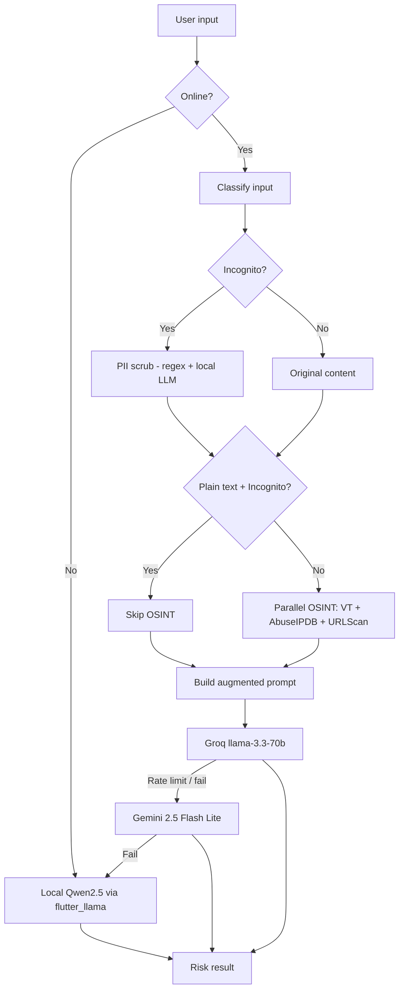

# SMD — Scam Message Detector

**Gen Digital · Norton Mobile Engineering AI-First Intern Assignment**  
**Author:** Shakhzod  
**Chosen option:** **Option B — Scam Message Detector Prototype**

---

## Project Overview

**SMD.** is a Flutter mobile app that helps users check whether a suspicious SMS, email snippet, URL, or `.eml` file looks like a scam. You paste or attach content, tap **Analyze**, and the app returns a risk level (`SAFE`, `SUSPICIOUS`, or `DANGEROUS`), a confidence score, and a short explanation.

The app goes beyond a simple “send text to ChatGPT” flow. It runs a small **SOAR-style pipeline** (Security Orchestration, Automation, and Response):

1. Classify the input (plain text, URL, IP, or EML)
2. Optionally scrub PII when **Incognito mode** is on
3. Gather threat intelligence from external APIs (VirusTotal, AbuseIPDB, URLScan.io)
4. Build an augmented prompt with OSINT context
5. Send it to cloud AI (Groq → Gemini cascade)
6. Fall back to an on-device model when offline or when cloud APIs fail (**Android only** for local inference)

I built this as a prototype, not a production Norton product. The focus was on clean architecture, realistic threat-analysis flow, and learning how to work with AI tools during development.

---

## Features


| Feature                       | Description                                                                                                                             |
| ----------------------------- | --------------------------------------------------------------------------------------------------------------------------------------- |
| **Message analysis**          | Paste suspicious text or links and get a structured risk verdict                                                                        |
| **EML attachment**            | Pick an `.eml` file; the app parses the body and reads SPF/DKIM/DMARC headers                                                           |
| **Sample messages**           | Three built-in examples (fake bank alert, prize scam, IRS impersonation)                                                                |
| **Cloud AI cascade**          | Groq (`llama-3.3-70b-versatile`) first, then Gemini (`gemini-2.5-flash-lite`)                                                           |
| **OSINT enrichment**          | VirusTotal, AbuseIPDB, and URLScan.io run in parallel when URLs/IPs are found                                                           |
| **Incognito mode** *(extra)*  | On-device Qwen2.5-1.5B model (~1 GB), PII redaction, optional OSINT skip — **Android only** (see [Platform support](#platform-support)) |
| **Offline support**           | Uses the local model when there is no internet (if downloaded) — **Android only**                                                       |
| **Background model download** | Large model downloads in the background with progress UI and notifications — **Android only**                                           |
| **Result UI**                 | Risk badge, confidence bar, and explanation card with fade/slide animation                                                              |
| **Norton-inspired theme**     | Light UI with Norton yellow accents; subtle warm tint in Incognito mode                                                                 |


---

## Platform support


| Capability                                 | Android          | iOS                    |
| ------------------------------------------ | ---------------- | ---------------------- |
| Cloud analysis (Groq → Gemini)             | Yes              | Yes (expected)         |
| OSINT (VirusTotal, AbuseIPDB, URLScan)     | Yes              | Yes (expected)         |
| EML attachment parsing                     | Yes              | Yes (expected)         |
| Incognito / local Qwen via `flutter_llama` | **Yes** (tested) | **No** — not validated |
| Offline local fallback                     | **Yes** (tested) | **No** — not validated |


### Please run and review on Android

**Local llama (Incognito mode, offline analysis, and the ~1 GB model download) is implemented and tested only on Android.**

I did not have access to a Mac or physical iPhone during development, so I could not run `pod install`, build the native `flutter_llama` stack on iOS, or verify Incognito end-to-end on a real device. The Dart layer deliberately treats non-Android platforms as “local model unavailable” (`LlamaNativeProbe` returns `false` off Android), so the app should still launch on iOS and use **cloud analysis**, but **do not expect Incognito or offline local inference on iOS**.

**For grading, demos, and bug reports, please use an Android device or emulator.** That is the only platform where the full feature set was verified.

iOS project files are included (`ios/`, minimum deployment target **14.0** for `background_downloader`), but iOS is **best-effort** until someone can validate a Mac build.

---

## Setup Instructions

### Prerequisites

- [Flutter SDK](https://docs.flutter.dev/get-started/install) **^3.11.0**
- **Android:** Android Studio and an emulator or physical device (**recommended for full testing**)
- **iOS (optional):** macOS with Xcode 15+ and CocoaPods — only needed if you want to try the iOS build; cloud features should work, local llama will not
- API keys (see below)

### 1. Clone and configure environment

```bash
git clone <your-repo-url>
cd norton-aifirst-intern-shakhzod
cp .env.example .env
```

Edit `.env` and add your keys:


| Variable             | Required                     | Purpose                                                |
| -------------------- | ---------------------------- | ------------------------------------------------------ |
| `GEMINI_API_KEY`     | **Yes** (for cloud analysis) | [Google AI Studio](https://aistudio.google.com/apikey) |
| `GROQ_API_KEY`       | Recommended                  | Primary cloud provider (free tier)                     |
| `VIRUSTOTAL_API_KEY` | Optional                     | URL reputation lookup                                  |
| `ABUSEIPDB_API_KEY`  | Optional                     | IP abuse scoring                                       |
| `URLSCAN_API_KEY`    | Optional                     | URL scan submission                                    |


OSINT calls fail gracefully if keys are missing — analysis still works, just without threat-intel context.

### 2. Install dependencies and generate code

```bash
flutter pub get
dart run build_runner build --delete-conflicting-outputs
```

This generates Riverpod providers, Freezed models, and `envied` env bindings.

### 3. Android only: set up on-device AI (flutter_llama)

> **Skip this section on iOS.** Local inference is not supported off Android in this prototype.

The `flutter_llama` package on pub.dev does not ship `llama.cpp` sources. On **Android**, run a one-time setup script after every `flutter pub get` or cache clear:

**Windows (PowerShell):**

```powershell
.\tool\setup_flutter_llama.ps1
```

**macOS / Linux:**

```bash
chmod +x tool/setup_flutter_llama.sh
./tool/setup_flutter_llama.sh
```

The script clones `llama.cpp` into the pub cache and applies CPU-only Android patches (Vulkan cross-compile was failing on my setup).

> **Note:** Incognito mode and offline analysis only work after this step **and** after downloading the ~1 GB Qwen model inside the app.

### 4. Run the app

**Android (recommended — full features):**

```bash
flutter run
# or pick a device: flutter devices && flutter run -d <device_id>
```

**Release APK (Android):**

```bash
flutter build apk --release
# Output: build/app/outputs/flutter-apk/app-release.apk
```

**iOS (macOS only — cloud path; local llama not tested):**

```bash
flutter pub get
cd ios && pod install && cd ..
flutter run -d <iphone_or_simulator>
```

The iOS deployment target is **14.0** (`ios/Podfile`, `IPHONEOS_DEPLOYMENT_TARGET` in Xcode) because `background_downloader` requires iOS 14+.

### Troubleshooting


| Problem                                                        | Fix                                                                                            |
| -------------------------------------------------------------- | ---------------------------------------------------------------------------------------------- |
| Kotlin cache errors (project on `E:` drive, pub cache on `C:`) | `android/gradle.properties` already sets `kotlin.incremental=false`                            |
| CMake / llama build errors (Android)                           | Run `flutter clean`, re-run the setup script, then build again                                 |
| Cloud analysis fails                                           | Check `.env` keys; Groq free tier rate-limits quickly — Gemini is the fallback                 |
| Incognito analysis crashes on Android                          | Make sure setup script ran; local inference uses CPU-only config (`nGpuLayers: 0`)             |
| Incognito / offline does nothing on iOS                        | Expected — local llama is Android-only in this build; use cloud mode or test on Android        |
| CocoaPods / deployment target on iOS                           | Ensure `ios/Podfile` has `platform :ios, '14.0'` and run `pod install` after `flutter pub get` |
| `Generated.xcconfig` missing (iOS)                             | Run `flutter pub get` from the project root before `pod install`                               |


---

## Architecture / Technical Overview

The project uses **feature-first clean architecture** with **Flutter Riverpod**, **Freezed**, **go_router**, and **Dio**.

```
lib/
├── core/                    # Shared: theme, routing, env, notifications, background tasks
├── features/
│   ├── splash/              # Animated splash → home
│   └── scam_detector/
│       ├── data/            # Repositories, datasources, DTOs, services
│       ├── domain/          # Entities, use cases, repository interfaces
│       └── presentation/    # Screens, widgets, Riverpod controllers
└── main.dart
```

### Analysis pipeline




### Key components


| Layer        | Component                        | Role                                                  |
| ------------ | -------------------------------- | ----------------------------------------------------- |
| Domain       | `OrchestrateScamAnalysisUseCase` | Main SOAR orchestrator                                |
| Domain       | `BuildAugmentedPromptUseCase`    | Merges scrubbed text + OSINT + email auth             |
| Data         | `ScamAnalysisRepositoryImpl`     | Groq → Gemini cloud cascade                           |
| Data         | `LocalScamAnalysisService`       | On-device scam verdict via `flutter_llama`            |
| Data         | `LocalPiiRedactionService`       | Hybrid regex + local LLM PII scrubbing                |
| Data         | `ModelDownloadService`           | Background download of Qwen2.5 GGUF from Hugging Face |
| Presentation | `ScamAnalysisController`         | Riverpod state for analyze / reset                    |
| Presentation | `IncognitoModeController`        | Toggle + model download lifecycle                     |


### Tech stack

- **Flutter** 3.11+, **Dart** 3.11+
- **State:** `flutter_riverpod` + `riverpod_annotation`
- **Routing:** `go_router`
- **Networking:** `dio`, `google_generative_ai`
- **Local AI (Android only):** `flutter_llama` + Qwen2.5-1.5B-Instruct (Q4_K_M, ~1 GB)
- **Background work:** `background_downloader`, `flutter_foreground_task`, `flutter_local_notifications`
- **Email parsing:** `enough_mail`
- **Code gen:** `freezed`, `json_serializable`, `envied`, `build_runner`

---

## Screenshots

> Replace the placeholders below with actual screenshots from a running build.


| Screen            | Description                                 |
| ----------------- | ------------------------------------------- |
| Home (cloud mode) | Main input, sample messages, Analyze button |
| Analysis result   | Risk badge + confidence bar + explanation   |
| Incognito mode    | Warm privacy accent, download progress      |
| Offline warning   | Dialog when no network and no local model   |


```
docs/screenshots/01-home-cloud.png
docs/screenshots/02-analysis-result-dangerous.png
docs/screenshots/03-incognito-mode.png
docs/screenshots/04-eml-attachment.png
docs/screenshots/05-offline-local-result.png
```


---

## Demo Video

> Record a short walkthrough (2–3 minutes) showing: paste sample → analyze → result → toggle Incognito → offline behavior.

```
docs/demo/smd-demo.mp4
```

**Suggested demo script (use Android for steps 4–5):**

1. Open app on **Android**, tap a sample message (e.g. “Fake bank alert”)
2. Analyze and show `DANGEROUS` result with explanation
3. Attach an `.eml` file and show email-auth context in logs
4. Enable Incognito, show model download dialog *(Android)*
5. Turn off Wi‑Fi, analyze again with on-device model *(Android)*

---

## Cursor AI rules (`.cursorrules`)

The repo includes a `[.cursorrules](.cursorrules)` file at the project root. **Cursor loads it automatically** for every chat and agent session in this workspace, so the model follows the same engineering standards without repeating them in each prompt.

The file defines how AI should help with this Flutter codebase:


| Section          | What it enforces                                                                                           |
| ---------------- | ---------------------------------------------------------------------------------------------------------- |
| **Architecture** | Feature-first clean architecture (`data` / `domain` / `presentation`), dependency inversion, `go_router`   |
| **State**        | Riverpod with code generation, `AsyncValue` for async work, `freezed` + `json_serializable`                |
| **Performance**  | Slivers for complex lists, isolates for heavy work, image cache limits, `RepaintBoundary`, `const` widgets |
| **Security**     | No secrets in `SharedPreferences`; `envied` for `.env`; certificate pinning on Dio                         |
| **Testing**      | High domain/data coverage, golden tests over fragile text assertions, Riverpod overrides in tests          |
| **Pitfalls**     | `context.mounted` after `await`, dispose controllers, no force-unwrap `!`                                  |
| **Tooling**      | Respect FVM (`.fvmrc`), strict analysis, `log()` instead of `print()`, `unawaited_futures`                 |
| **UI**           | Design tokens only in `core/theme/` — no hardcoded colors/sizes in widgets                                 |


When I start a new Cursor task, I rely on `.cursorrules` for consistency; for one-off fixes (docs, tooling, README) I still add a short explicit prompt (see the log below).

---

## Git commits with [git-agent](https://github.com/GitAgentHQ/git-agent-cli)

Besides Cursor for writing code, I use **[git-agent](https://github.com/GitAgentHQ/git-agent-cli)** when I commit. It uses AI to look at your changed files, compare them, and write the commit title and description for you.

I do not like thinking up commit names. Writing a clear title and a short description used to take me a long time. In my experience, **git-agent does this very well** — the subject and body usually match what I changed and are easy to read. I still check the diff before I commit, but I save a lot of time.

Another useful feature: from the context of the changes, git-agent can **split work into several commits** and group files by logic (for example, UI changes in one commit and tests in another), instead of one big commit with everything mixed together.

Typical workflow:

```bash
git add .
git-agent commit
```

Install the CLI from the [releases page](https://github.com/GitAgentHQ/git-agent-cli/releases) and set up a provider once (`git-agent init`). On Windows I used the `git-agent-windows-amd64` build and added it to my user `PATH`.

---

## AI Interaction Log

Below are **seven real prompts** from my Cursor chats during this project. I did not copy AI output blindly — I reviewed, tested, and often sent follow-up prompts to fix wrong suggestions.

---

### 1. One-shot MVP bootstrap (first project chat)

**Prompt:**

> You are a senior Flutter mobile engineer with 8+ years of experience building production-grade, pixel-perfect mobile applications. Your code follows clean architecture principles (feature-first folder structure), uses proper state management with Riverpod, and adheres strictly to Flutter/Dart best practices.
>
> Generate Flutter project and build a Scam Message Detector Flutter screen as a single fully self-contained feature. The app allows users to paste or type a suspicious message (SMS, email snippet, or URL) and receive an AI-powered risk assessment using the Anthropic Claude API (claude-sonnet-4-20250514).
>
> Splash Screen:
> Background: Color (very light gray, almost white)
> Center text: "Scam Message Detector" in bold, large font, color yellow
> Play a smooth animation: text scales down and morphs/transitions into "SMD." in large bold yellow, with "norton intern" in smaller gray below it
> At the bottom: "by Shakhzod" in small, muted gray italic text 
>
> Home Screen
> Top-left logo: Small SMD shield or letter-mark logo widget (custom painted or asset), placed in an AppBar with transparent/white background, no elevation
> Center description text: Small, gray, centered subtitle — e.g.:
> "Paste a suspicious SMS, email, or URL below. Our AI will assess the scam risk instantly."
> Input Field:
>
> Multiline TextFormField, rounded corners with black border color
> Hint text: "Enter a URL, message, email, or snippet to check for scams."
> Minimum 5 lines, expands with content
>
> Analyze Button:
>
> Outlined style: yellow, black border, black text, bold, rounded corners. After clicking, it freezes because a request is being sent to the AI. 
>
> Result Card (shown after analysis):
>
> Animated FadeTransition slide-in card
>
> displays:
> Risk Level badge: SAFE (green), SUSPICIOUS (orange), or DANGEROUS (red) — use colored Chip or Container with rounded pill shape
> Confidence Score: e.g., "Confidence: 87%" with a linear progress bar colored by risk level
> Explanation text: 2–3 sentence AI-generated or heuristic explanation of why the message was flagged
>
> About app:
> Scam Message Detector. a mobile app screen where a user can paste or type a suspicious message (SMS, email
> snippet, or URL) and get an AI-generated risk assessment
> Text input field where the user can paste a message or URL
> • An “Analyze” button that triggers analysis (you may call a public AI API such as OpenAI
> or Claude, or use a local heuristic / regex-based approach)
> • Display results showing: risk level (Safe / Suspicious / Dangerous), confidence score,
> and a brief explanation of why the message was flagged
> • Show at least 2 example scam messages the user can tap to auto-populate the input
> field

**Follow-up prompt (same chat):**

> Replace ANTHROPIC Claude ai to Gemini gemini-3.1-pro-preview

**AI response (summary):**
Ran `flutter create`, read `.cursorrules`, and scaffolded feature-first architecture under `lib/features/scam_detector` (Riverpod, splash → home, sample messages, Claude datasource). After the follow-up, swapped the cloud provider to Gemini.

**My commentary:**
This was the real starting point for the whole assignment — one long prompt with UI specs. Cursor delivered a runnable MVP quickly. I kept the Norton-yellow UI direction but changed a lot later: Groq cascade, SOAR/OSINT, EML upload, Incognito local model, and six calibrated sample messages.

---

### 2. SOAR upgrade — full security architecture spec

**Prompt:**

> You are an elite Senior Cybersecurity Architect, and Senior Flutter Developer. Your objective is to refactor, enhance, and scale an existing Flutter mobile application. Currently, the app features a basic implementation where a user inputs a message, and it is sent directly to a cloud AI model (using google_generative_ai and an existing GeminiRemoteDataSource) which returns a basic JSON risk assessment (ScamAnalysisDto).
>
> Your task is to upgrade this basic architecture into a robust Security Orchestration, Automation, and Response (SOAR) tool. You will achieve this by modifying the existing pipeline to integrate an "Incognito Mode" with local LLM PII-scrubbing, external Threat Intelligence (OSINT) APIs, and EML header parsing before the data is finally sent to the existing Gemini model.
>
> Architectural Rules & Constraints:
> You must adhere strictly to the following architectural guidelines across all refactored code:
>
> State Management: Use flutter_bloc or riverpod (choose one and remain strictly consistent throughout the entire implementation) to orchestrate the new multi-step asynchronous flow.
>
> Network Client: Use the dio package for all new OSINT HTTP requests. You must implement robust error handling (catching DioException), configure timeouts, and utilize interceptors for injecting API keys securely.
>
> Code Structure: Follow Clean Architecture principles. Do not break the existing GeminiRemoteDataSource, but wrap it or call it from a higher-level Use Case that first gathers the external OSINT context.
>
> Security: NEVER hardcode API keys. Use flutter_dotenv for managing environment variables.
>
> Language Features: Ensure 100% sound null safety using modern Dart 3.x syntax (e.g., records, pattern matching where appropriate).
>
> Core Features & Modules to Implement:
>
> Feature 1: The Incognito Privacy Engine (On-Device LLM via flutter_llama)
>
> Implement a global state toggle for "Incognito Mode" in the UI.
>
> Privacy Constraint: When Incognito is ON, external OSINT API calls (VirusTotal, URLScan) MUST NOT be executed if the input is a raw text snippet, as they may leak proprietary data to public repositories.
>
> Before sending any data to the existing GeminiRemoteDataSource, the input MUST be scrubbed of Personally Identifiable Information (PII).
>
> Use the flutter_llama package to execute a local LLM strictly for this PII redaction.
>
> Llama Configuration: Show the exact setup using LlamaConfig with parameters: modelPath (assume a downloaded GGUF file path), nThreads: 4, nGpuLayers: -1 (to offload all layers to the GPU via Metal/Vulkan), and useGpu: true.
>
> Generation Parameters: Configure GenerationParams with a low temperature: 0.1 to ensure deterministic redaction. Define the explicit system prompt for the local model: "Redact all PII from the following text, replacing it with. Return only the scrubbed text without any additional commentary."
>
> Feature 2: Threat Intelligence Aggregator (Data Layer / OSINT)
> Create distinct repository classes for the following APIs using the dio client to gather context before invoking Gemini:
>
> VirusTotal API v3: Implement URL scanning logic.
>
> Step 1 (Submission): Execute a POST request to [https://www.virustotal.com/api/v3/urls](https://www.virustotal.com/api/v3/urls). The URL must be passed as form data (application/x-www-form-urlencoded).
>
> Step 2 (Retrieval): Parse the returned Analysis ID from Step 1, then execute a GET request to [https://www.virustotal.com/api/v3/urls/{id}](https://www.virustotal.com/api/v3/urls/{id}) to fetch the scan report. Extract the count of malicious detections.
>
> AbuseIPDB API v2: Implement an IP reputation check.
>
> Execute a GET request to [https://api.abuseipdb.com/api/v2/check](https://api.abuseipdb.com/api/v2/check).
>
> Pass the IP address and critically include the query parameter maxAgeInDays: 90.
>
> Include the API key in the Key HTTP header. Extract the abuseConfidenceScore and totalReports.
>
> URLScan.io: Implement URL submission.
>
> Execute a POST request to [https://urlscan.io/api/v1/scan](https://urlscan.io/api/v1/scan).
>
> The payload must be JSON containing the url and visibility. To respect user privacy, explicitly force the parameter visibility: 'unlisted' or 'private' rather than the default public setting.
>
> Feature 3: EML Parsing and Header Authentication Engine
>
> Integrate the enough_mail package to parse raw .eml file contents if the user uploads a file.
>
> Convert the raw text into a MimeMessage object.
>
> Extract the Authentication-Results header from the MimeMessage.
>
> Write a robust utility function leveraging Regular Expressions to evaluate the cryptographic alignments of SPF, DKIM, and DMARC.
>
> The utility should return a structured Dart Record indicating the pass/fail state of spf, dkim, and dmarc.
>
> Feature 4: Upgrading the Final AI Risk Evaluator
>
> Refactor the existing analyzeMessage(String message) method in GeminiRemoteDataSource. Instead of just passing the raw user message, create an evaluation Use Case that formats a comprehensive master prompt string containing all newly gathered intelligence.
>
> The string sent to _model.generateContent should synthetically combine:
>
> The (potentially scrubbed via local LLM) original user input.
>
> The VirusTotal malicious detection count.
>
> The AbuseIPDB confidence score.
>
> The email authentication protocol results (if an EML file was provided).
>
> Note: Retain the existing scamAnalysisResponseSchema and GenerationConfig mapping so the app continues to safely parse the ScamAnalysisDto.
>
> Feature 5: Resilient Testing Strategy
>
> Provide a comprehensive unit test file demonstrating how to test the new VirusTotalRepository.
>
> You must use the mockito or http_mock_adapter packages to intercept and mock the dio client calls.
>
> Ensure you write tests for both a 200 OK success scenario (returning a mock VT JSON payload) and an error scenario (e.g., simulating a 429 Too Many Requests), demonstrating that the repository handles DioException gracefully without crashing the app.
>
> Execution Steps for the AI (Please output sequentially):
>
> Dependencies: Provide the updated pubspec.yaml snippet containing all new required dependencies (dio, flutter_llama, enough_mail, mockito or http_mock_adapter).
>
> OSINT Data Layer: Generate the new Data Layer code containing the Repositories for VirusTotal, AbuseIPDB, URLScan, and the Email Parsing utility. Include the exact Dio configurations and header injections.
>
> Local AI Privacy Service: Generate the Local AI Redaction Service using flutter_llama, showing the exact instantiation of LlamaConfig and GenerationParams.
>
> Refactored Gemini Integration & State Management: Generate the updated Use Case and BLoC/Riverpod state management logic that handles the new pipeline: User Input -> Check Incognito -> (Optional) Local PII Redaction -> Future.wait Concurrent API Fetching -> Format Augmented Prompt -> Call existing GeminiRemoteDataSource -> Yield ScamAnalysisDto.
>
> User Interface: Update the existing UI screen to feature the Incognito Mode toggle switch and properly trigger the new BLoC/Riverpod events.
>
> Unit Tests: Generate the Dio Mock Unit Test suite for the network layer.
>
> Output Format: Provide your response entirely as properly structured Dart code blocks. Include brief, expert-level architectural commentary between the blocks explaining the 'why' behind specific design decisions. Ensure all code is production-ready, highly modular, and seamlessly integrates with the user's existing Gemini setup

**AI response (summary):**
Proposed OrchestrateScamAnalysisUseCase, OSINT repositories (Dio + env keys), LocalPiiRedactionService, EML auth parser, and augmented prompt builder. Later I split prompt building into its own use case and fixed parallel OSINT + Incognito skip rules in follow-ups.

**My commentary:**
This is the most important architecture prompt in the project — it turned a “send text to Gemini” demo into a SOAR pipeline. The AI’s first draft was a god method (~200 lines); I had to follow up with smaller prompts to extract use cases and nullable OSINT results.

---

### 3. Offline fallback with explicit deliverables

**Prompt:**

> Implement offline-fallback scam analysis with user warnings.
>
> ## Goal
>
> If the device has no internet connection, fall back to the on-device Llama model
> for scam analysis. If internet is available, keep the existing flow unchanged.
>
> ---
>
> ## Connectivity check
>
> - Add a connectivity helper (use `connectivity_plus`) that returns a bool `isOnline`.
> - Check connectivity at the start of `OrchestrateScamAnalysisUseCase.call()`,
> before any network work.
>
> ---
>
> ## Offline flow
>
> When `isOnline == false`:
>
> 1. Skip all OSINT calls (VirusTotal, AbuseIPDB, URLScan) — they require network.
> 2. Skip the cloud model (`ScamAnalysisRepository.analyzeAugmentedPrompt`).
> 3. Run PII scrubbing locally as usual (already on-device).
> 4. Pass the scrubbed text directly to the local Llama model for scam analysis.
> 5. Parse the local model's plain-text response into a `ScamAnalysis` object.
> 6. Attach a flag to the result: `resolvedLocally: true`.
>
> If the local model is not yet downloaded/loaded when offline:
>
> - Do NOT attempt analysis.
> - Return a special error state: `localModelUnavailable: true`.
>
> ---
>
> ## Warning UI — two cases
>
> ### Case A — offline but local model is ready
>
> Show a non-blocking warning banner above the result card every time the user
> gets an offline result. Content:
>   Title: "Local analysis only"
>   Body: "No internet connection. This result was generated on-device and may
>          be less accurate. Connect to the internet for full analysis."
>
> ### Case B — offline and local model not downloaded yet
>
> Show a blocking message instead of any result. Content:
>   Title: "Analysis unavailable"
>   Body: "No internet connection and the local model hasn't been downloaded yet.
>          Please connect to the internet to analyze this message."
>
> ---
>
> ## Design requirements for both warnings
>
> - Match the existing app's minimal design language exactly — same font, same
> border radius, same spacing tokens already used in the app.
> - Warning banner (Case A): use the app's existing amber/yellow semantic color
> (warning tone), subtle background fill, thin left border accent, no icon
> or a simple outlined warning icon — nothing loud.
> - Blocking message (Case B): same minimal style, use the app's error/red
> semantic color, centered layout, no heavy UI.
> - No custom shadows, no gradients, no heavy illustrations.
> - Both widgets must be their own small reusable widgets:
> `LocalAnalysisWarningBanner` and `LocalModelUnavailableMessage`.
>
> ---
>
> ## What NOT to change
>
> - The existing online flow must remain byte-for-byte identical.
> - Do not modify `BuildAugmentedPromptUseCase`, OSINT repositories, or any
> provider that is only used in the online path.
> - Do not change `LocalPiiRedactionService` — it is already correct.
>
> ---
>
> ## Deliverables
>
> 1. `ConnectivityService` — thin wrapper around `connectivity_plus`.
> 2. Updated `OrchestrateScamAnalysisUseCase` with offline branching.
> 3. A `LocalScamAnalysisService` that calls `FlutterLlama` for scam verdict.
> 4. `ScamAnalysis` extended with `resolvedLocally` and `localModelUnavailable`
>   flags (keep all existing fields intact).
> 5. `LocalAnalysisWarningBanner` widget (Case A).
> 6. `LocalModelUnavailableMessage` widget (Case B).
> 7. Riverpod wiring for `ConnectivityService` and `LocalScamAnalysisService`.

**AI response (summary):**
Added connectivity check, offline branch in the orchestrator, local analysis service, result flags, and two warning widgets matching existing design tokens.

**My commentary:**
Structured specs with “deliverables” and “what NOT to change” worked much better than vague requests. I ran `flutter test` after every merge to ensure the online path did not regress.

---

### 4. Background download, notifications, and Incognito UX

**Prompt:**

> Make it so that the model can download in the background, even when the app is closed, and send a notification once the download is complete. Also, allow AI requests to run in the background when the app is closed, and send a notification when the analysis is finished.
>
> When switching to incognito mode, the design changes drastically. It’s not very pleasant to look at—please fix this as Senior Designer.

**AI response (summary):**
Integrated `background_downloader` + `flutter_local_notifications`, wired `BackgroundWorkCoordinator`, and softened Incognito styling to subtle warm accents instead of a harsh full dark theme flip.

**My commentary:**
The AI over-scoped background *analysis* on mobile (OS limits); I kept background **download** + notification, but analysis still runs in foreground where needed. I rewrote Incognito copy so users know a 1 GB download continues in background — the first dialog said “please wait,” which is wrong for large files.

---

### 5. Expandable pipeline log on the result card

**Prompt:**

> You are senior flutter developer. Update user ui. Add a detailed log to the AI's response. Leave the response and UI as they are, but make it possible to expand the response by clicking on it to view a very detailed log of the checks performed, including VirusTotal and other stages.

**AI response (summary):**
Added `PipelineLog.beginCapture()` / `takeCapture()` per analysis run, attached `pipelineLog` to `ScamAnalysis`, and made `ResultCard` tappable to expand a stage-by-stage trace (connectivity, PII, OSINT, Groq/Gemini/local routing) without changing the verdict UI.

**My commentary:**
This made the SOAR pipeline visible to reviewers and to me during debugging — same format as console `[PipelineLog]` lines. Later I also tightened dev-console payload logging and asked for automated tests (see example 6).

---

### 6. Unit tests for all pipeline stages (senior tester)

**Prompt:**

> You are a senior tester and a mobile app developer with extensive experience. Write me the logs for each stage, steps (GEMINI,GROQ, VIRUSTOTAL,ABUSEIPDB , URLSCAN, LLama local model)  so I can understand how they work. And write tests for all stages as senior tester. Use tests to verify that all services are working properly and that the local model is functioning correctly

**AI response (summary):**
Added `[PipelineLog]` tracing across the orchestrator and wrote unit tests for Gemini/Groq datasources, OSINT repositories (VirusTotal, AbuseIPDB, URLScan), cloud cascade (`scam_analysis_repository_test.dart`), local PII/scam services, orchestrator paths, and parser fallbacks.

**My commentary:**
This prompt asked for both observability and tests in one message — it produced most of the **88 passing tests** in the repo. I fixed AI-generated mocks that threw generic `Exception` instead of typed `GroqDataSourceException`, which broke cascade tests. Tests run with `flutter test` after every significant change.

---

### 7. Modern 2026 home UI — input field as the hero component

**Prompt:**

> Place the “analyze” button inside the input field, at the bottom right. Have it appear when the user types something, and have it appear with some kind of animation (start small and then grow larger, as if it’s being born and expanding). Also place the “Upload .eml” button inside the bottom left of the field—make it a button. And place the Incognito mode button above the input field. When Incognito mode is enabled, let the app’s design change slightly—make it a bit darker. And when you click “Analyze,” don’t use a spinning indicator—instead, create a nice design and loading animation, and display a message saying, “We’re analyzing your response using AI; the AI will check what you wrote.” Make the design modern, and have this animation appear above the input field or in its place.

**Follow-up prompt 1:**

> You're a talented and in-demand senior designer and senior mobile engineer/developer. For the analysis, I need a more interesting animation (something cool and modern for 2026) rather than just an indicator, and I want the icon on top of the input field removed just get rid of the icon altogether. 
>
> The “Analyze” button doesn’t appear the way I wanted, it should grow from right to left! When the ‘Analyze’ button is there, there’s barely enough space for “Upload .eml”; you could just write “.eml” there, and I think the icon is clear, or do it however you see fit as a senior designer. 
>
> And the three tooltips need to be done differently, I don’t like them; they take up too much space below the input field. And let the incognito mode be like the app’s dark mode.

**Follow-up prompt 2:**

> I like the blobs, but get rid of _NeuralNodesPainter. And make sure the blobs are there in non-incognito mode too. Also, remove beamPaint and linePaint. You’re a senior designer—you’re creating a minimalist yet beautiful, modern design for the AI era of 2026. Make them centralized and minimalist. Blobs are beautiful—I like them.

**Follow-up prompt 3:**

> Let Bobls be available in normal mode as well, not just in incognito mode. And centralize all content within the analysis interface.

**Follow-up prompt 4:**

> Title
> Subtitle
> Phase line
> Progress bar
> These columns should be centered within the container, with the bubbles behind them, not on top of them.

**Follow-up prompt 5:**

> I don't want it to have a fixed size; let it be the same size as the input field! And let the “Try an example” section be located above the input field. The corners near the edge of the input field turn white during analysis; please fix this.

**AI response (summary):**
Built `MessageInputField` with embedded Analyze/EML actions, `AnalysisLoadingOverlay` with blob painter, Incognito-driven theme tint, and iterative layout fixes (symmetric scroll padding, no white corner artifacts on `MessageFieldShell`).

**My commentary:**
Design prompts worked best when I described motion direction (“grow right to left”) and hierarchy (“blobs behind text”). I rejected the AI’s first tooltip row — too tall. Several follow-ups refined padding, blob placement, and overlay sizing.

---

## Post–code review fixes (security & architecture)

A follow-up senior code review identified P0 security and architecture gaps. Below is what was reported, what we changed, and how a second AI pass on the diff validated the work.

### Review feedback → changes

| Priority | Issue | Change made |
| -------- | ----- | ----------- |
| **P0** | Incognito PII scrub failure sent **raw content** to cloud | `_safeScrubPii()` now throws `PiiScrubFailureException` when `incognitoEnabled` is true; cloud path never runs on scrub failure |
| **P0** | OSINT errors swallowed with `.onError((_, _) {})` | Replaced with `.catchError` + `PipelineLog.warn` per service (`OSINT.VT`, `OSINT.AbuseIPDB`, `OSINT.URLScan`) |
| **P0** | Full user payloads in `PipelineLog` / expandable UI | `PipelineLog.redactSensitiveBody()` truncates to 50 chars + `… [redacted]` in **release** (`kReleaseMode`); debug keeps full body |
| **P1** | Domain imported data layer in orchestrator | Added `ConnectivityRepository`, `LocalAnalysisRepository`, `ModelRepository` + data adapters; orchestrator depends on domain only |
| **P1** | Sentinel `ScamAnalysis(safe, localModelUnavailable: true)` | Introduced sealed `AnalysisOutcome` (`AnalysisSuccess`, `LocalModelUnavailable`, `AnalysisError`); UI/controller pattern-match |
| **P1** | `(dto as dynamic).toEntity()` in cloud cascade | Typed cascade as `Future<ScamAnalysisDto>` → `dto.toEntity()` |
| **P1** | Dead `AnalyzeMessageUseCase`, unused `shared_preferences` | Removed use case + provider; dropped `shared_preferences` from `pubspec.yaml` |
| **P2** | Hardcoded colors/sizes in log panel, Incognito switch, input field | Moved tokens to `AppColors`, `AppTextStyles`, `AppSpacing` |

### Verification

```bash
flutter analyze   # 0 errors (info-only lints)
flutter test      # 121 passed
```

### Second AI review on the fix diff

After implementing the above, the same review checklist was re-run on the changed files:

- **Confirmed:** Incognito fail-closed path covered by new unit test (`throws PiiScrubFailureException when incognito scrub fails`).
- **Confirmed:** No remaining `domain/` imports of `data/` in the orchestrator.
- **Confirmed:** `HomeScreen` uses `switch (outcome)` instead of `localModelUnavailable` / `localAnalysisFailed` flags on fake `SAFE` results.
- **Suggested (not in scope):** Remove legacy boolean fields on `ScamAnalysis` entirely in a later cleanup PR; certificate pinning on Dio remains a production follow-up.

---

## AI Code Review Summary

I asked Cursor to review completed modules before merging. Below is what it suggested and what I actually changed.


| Area                            | AI suggestion                                          | What I did                                                                                                                           |
| ------------------------------- | ------------------------------------------------------ | ------------------------------------------------------------------------------------------------------------------------------------ |
| **Orchestrator error handling** | Wrap every step in try/catch and show raw errors to UI | Kept typed exceptions (`AnalyzeMessageException`); OSINT failures are swallowed, cloud failures trigger local fallback               |
| **LocalScamAnalysisService**    | Use streaming `generateStream()` for better UX         | Rejected — `flutter_llama` 1.1.2 has EventChannel race bugs; kept non-streaming `generate()` with timeout                            |
| **PII redaction**               | Send raw text to cloud after regex only                | Rejected for Incognito — built hybrid: regex baseline + local LLM, with validation that rejects bad LLM output                       |
| **Gemini model ID**             | Use `gemini-1.5-pro`                                   | Changed to `gemini-2.5-flash-lite` after checking latency and structured-output support                                              |
| **Repository cascade**          | Single provider with retry loop                        | Accepted pattern but simplified: Groq → Gemini only, local fallback stays in use case                                                |
| **HomeScreen**                  | Split into 3 separate widget files immediately         | Partially accepted — extracted widgets (`ResultCard`, `IncognitoModeSwitch`, etc.) but kept screen logic in one file for readability |
| **Model download**              | Block UI with modal until download finishes            | Rejected — background download + notification is better UX for 1 GB                                                                  |
| **Android llama build**         | Enable GPU/Vulkan for speed                            | Rejected — caused `ggml_abort` on multiple devices; CPU-only patch in `tool/patches/flutter_llama/`                                  |
| **Widget test**                 | Assert text "Try an example"                           | Test is outdated — UI now says "Sample messages" / "Tap to try one"; test needs update                                               |


**Overall:** AI was strong for boilerplate, test scaffolds, and exploring options. It was weak on native plugin edge cases and sometimes over-engineered error handling. The best results came when I gave small, specific prompts with file names and actual error logs.

---

## Testing

### Run all tests

```bash
flutter test
```

### Current status


| Category           | Files                                                                  | Notes                                      |
| ------------------ | ---------------------------------------------------------------------- | ------------------------------------------ |
| Cloud datasources  | `groq_remote_datasource_test.dart`                                     | JSON parsing, rate-limit detection         |
| OSINT repositories | `virus_total`, `abuse_ipdb`, `url_scan`                                | Happy path + API error mapping             |
| Cloud cascade      | `scam_analysis_repository_test.dart`                                   | Groq → Gemini fallback                     |
| PII / local AI     | `local_pii_redaction_service_test`, `local_scam_analysis_service_test` | Regex, LLM fallback, JSON/text parsers     |
| Orchestrator       | `orchestrate_scam_analysis_usecase_test.dart`                          | Online/offline paths, Incognito OSINT skip |
| Widget             | `widget_test.dart`                                                     | **1 outdated test** — UI copy changed      |


**121 tests pass** (includes Incognito fail-closed and pipeline-log redaction tests).

### What is covered

- Input validation (empty / too short messages)
- Parallel OSINT with graceful degradation
- Incognito PII scrubbing path
- Cloud exhaustion → local fallback
- Offline without model → `localModelUnavailable`
- Local native failures → `localAnalysisFailed`
- Regression tests for `ggml_abort` fixes (unload after generate, batchSize ≥ contextSize)

### Manual testing checklist

**Run on Android** for items marked *(Android)*.

- Paste sample “Fake bank alert” → expect `DANGEROUS`
- Analyze a clean message → expect `SAFE` or low risk
- Attach `.eml` with failing SPF/DKIM → check augmented prompt includes auth section
- *(Android)* Enable Incognito → download model → analyze with airplane mode
- Revoke Groq key → confirm Gemini fallback still works
- *(Optional, iOS)* Cloud-only analyze with sample message — Incognito should stay unavailable / cloud-only

---

## Reflection

### What did I learn?

- **Clean architecture pays off** when the pipeline grows. Starting with a simple Gemini call and evolving into SOAR was manageable because domain logic stayed separate from Flutter UI.
- **AI-assisted development is a skill.** Cursor helped me move fast on boilerplate, tests, and refactors, but I still had to read docs, logs, and native source for the hard bugs.
- **Local AI on mobile is hard.** Model size, C++ build setup, memory limits, and small models not following JSON schemas — all of this took much longer than expected.
- **Security UX matters.** Showing confidence, explaining *why* something is suspicious, and handling offline/cloud fallback gracefully feels closer to a real Norton-style product than a raw API demo.

### Incognito mode — extra time, mixed results

I spent extra time building **Incognito mode** even though it was not required by the assignment. It was my own idea because I thought private, on-device analysis fit the cybersecurity theme well.

If I did the project again, I would probably **skip this feature** or scope it down to regex-only PII redaction without a 1 GB local model. It consumed too much time. I hit many issues: local model quality, C++ runtime / `llama.cpp` setup, Android cross-compile problems, `ggml_abort` crashes, and model size limitations on mid-range phones.

Current local models do not fully match my expectations yet — offline answers are slower and less reliable than cloud. I would like the offline AI experience to work better in the future, maybe with a smaller fine-tuned model or a better-maintained Flutter inference plugin.

Despite the pain, I learned a lot about AI-assisted development and improved my day-to-day workflow with Cursor: smaller prompts, follow-up corrections, and always running tests before accepting generated code.

### What would I do differently?

1. **MVP first:** Ship cloud-only analysis end-to-end, then add Incognito as a stretch goal.
2. **Earlier device testing:** I would test on a real Android phone sooner — emulators hide native llama issues. I also lacked iOS hardware/Mac access, so Incognito was scoped to Android only.
3. **Fewer OSINT providers initially:** Three APIs plus cascade logic was a lot for a prototype; one (VirusTotal) would be enough at first.
4. **Fix the widget test** before submission — small polish item I ran out of time for.

---

## Future Improvements

- Fine-tune or distil a smaller on-device model for scam classification only
- Share/export analysis report (PDF or copy summary)
- Scan QR codes and clipboard links directly
- History of past analyses (local only, encrypted)
- iOS validation for `flutter_llama` / Incognito (Android-only today; needs Mac + device testing)
- Improve widget/integration test coverage for full UI flow
- Rate-limit UI feedback when Groq/Gemini quotas are hit
- Optional dark mode (Incognito currently uses a warm accent, not full dark theme)

---

## License & Attribution

Intern assignment project for **Gen Digital / Norton Mobile Engineering**.  
Built by **Shakhzod** as part of the AI-First Intern program.

**Package name:** `scam_message_detector` · **Display name:** SMD.